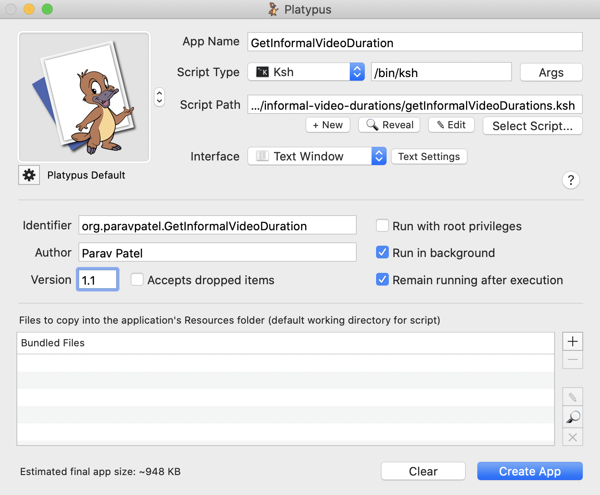

# GetInformalVideoDuration Application
Used by AV Team for ease in backup of informal videos and total duration time into Master DV Excel sheets.

MacOS Application build with [Platypus](https://sveinbjorn.org/platypus) with a ksh/bash script under the covers.

Utilizes [ffmpeg](https://www.ffmpeg.org/download.html) and [ffprobe](https://www.ffmpeg.org/download.html) to aggregate MTS, MP4, and MOV video lengths in a given subfolder directory.

Creates an output CSV file of the aggregated subfolder and it's total length of informal videos. Please see sample-durations.csv for an example.

# How to create Platypus Application:
1. Download [Platypus](https://sveinbjorn.org/platypus) and add this script to it's path.
2. Select `ksh` file type, Text Window interface, Run in background, Update Version number
3. Create application
4. Move application to "1485 Dt-29-09-19" folder and start to generate duration.csv file



# How to run manually:
1. Place file in the `1485 Dt-29-09-19` folder where you have all videos.
2. Then on terminal execute "./getNestedVideoDurationsFinal.kshs" to get total times of all three file types.
3. (Optional) Then on terminal execute "./getNestedVideoDurationsFinal.ksh <filetype - mov/mp4/MTS>" to get total time of a specific video file type.

# Expected folder structure:
```
1485 Dt-29-09-19
  -> 01 Aptavani 14 Parayan Morning Dt-29-09-19 Clips-142 Dur-
    -> Cam 01
        -> 0000.MTS, 0001.mp4, etc...
    -> Cam 02
        -> 0000.MTS, 0001.mov, etc...
  -> 02 Aptavani 14 Parayan Evening Dt-29-09-19 Clips-85 Dur-
    -> Cam 01
        -> 0000.mp4, 0001.MTS, etc...
```